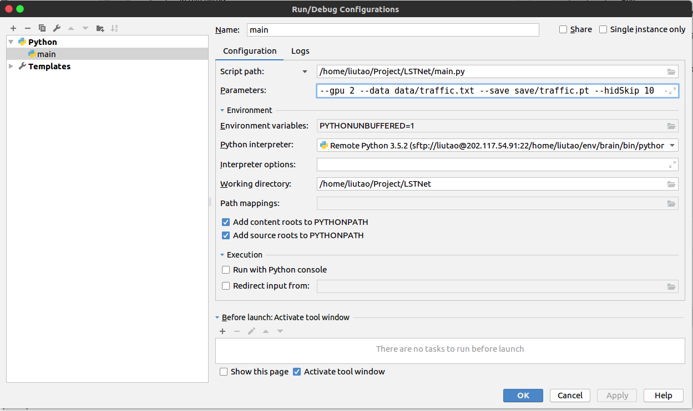

# 深度学习练习教程 —— 时间序列数据

<p align="center">


</p>


### 论文
[Modeling Long- and Short-Term Temporal Patterns with Deep Neural Networks.](https://arxiv.org/abs/1703.07015)

### 参考代码
[laiguokun/LSTNet](https://github.com/laiguokun/LSTNet)

### 数据集
[laiguokun/multivariate-time-series-data](https://github.com/laiguokun/multivariate-time-series-data)

### 参考资料
[pytorch官方文档](https://pytorch.apachecn.org/docs/1.2/)


### 运行
1. 在项目根目录下新建两个文件夹：data 和 save，从[数据集](https://github.com/laiguokun/multivariate-time-series-data)中下载4个数据集并放在data文件夹中。之后项目目录为：
   ```angular2html
    .
    ├── checkpoint.pt
    ├── data # 数据集
    │   ├── electricity.txt
    │   ├── exchange_rate.txt
    │   ├── solar_AL.txt
    │   └── traffic.txt
    ├── ele.sh
    ├── main.py # 程序主入口
    ├── models # 模型
    │   ├── attention.py
    │   ├── bak # 之前用过的模型代码备份
    │   │   ├── __init__.py
    │   │   ├── LSTM.py
    │   │   └── RNN.py
    │   ├── baseModel.py
    │   ├── CNN.py
    │   ├── GRU_attention.py
    │   ├── __init__.py
    │   ├── LSTNet.py
    │   └── MultiHeadAttention.py
    ├── Optim.py
    ├── pic
    │   ├── configuration.png
    │   ├── DrCubic1.png
    │   └── DrCubic.png
    ├── README.md
    ├── save
    ├── solar.sh
    ├── stock.sh
    ├── tools
    │   ├── early_stopping.py
    │   └── __init__.py
    ├── traffic.sh
    ├── traffic.sh.bak
    └── utils.py # 数据处理脚本
    ```

2. 如在PyCharm连接远程服务器运行，在Run/Edit Configurations中编辑运行参数
    

    或者在对应的脚本（traffic.sh, ele.sh等）编辑参数并运行
    ```angular2html
      ./traffic.sh
    ```

### 使用
- 更改 / 添加模型  
    1. 在models文件夹中添加或更改模型，注意py文件中模型名称统一为Model；
    2. 在main.py中第8行后面添加你的脚本名称
    
### 一些结果（欢迎补充）
| 模型 | rse | rae | corr |
| :--- | :---: | :---: | :---: |
|LSTNet|0.5076|0.3404|0.8591|
|RNN(base)|0.5549|0.4063|0.8342|
|LSTM(base)|0.5403|0.3736|0.8444|
|GRU(base)|0.5357|0.3689|0.8493|
|GRU(bidirectional)|0.5761|0.3929|0.8265|
|GRU(without output_fun)|0.5610|0.4076|0.8307|
|GRU(add early_stopping)|0.5367|0.3753|0.8460|
|GRU(attention)|0.5359|0.3716|0.8472|
|GRU(num_layers=2)|0.5285|0.3521|0.8531|
|GRU(num_layers=3)|0.5280|0.3536|0.8531|
|GRU(num_layers=4)|0.5241|0.3500|0.8561|
|GRU(num_layers=10)|0.5893|0.4175|0.8164|
|CNN|0.5685|0.4176|0.8223|

### 研究中遇到的问题
1. 加入early_stoping后表现变差  
    以GRU为例，最好的结果大概在第90个Epoch左右出现，但是在60个Epoch左右时会遇到一段瓶颈，loss不再下降，触发了early_stoping。
2. 对预测结果使用了激活函数后表现变好
3. 计算loss时，使用了output * scale操作
4. 注意数据预处理过程，以及最终数据的排布

### 开发计划
- 加入causal convolutional(因果卷积)模型
- 尝试将隐藏层的平均值作为预测依据进行预测（之前用的是最后一层隐藏状态）